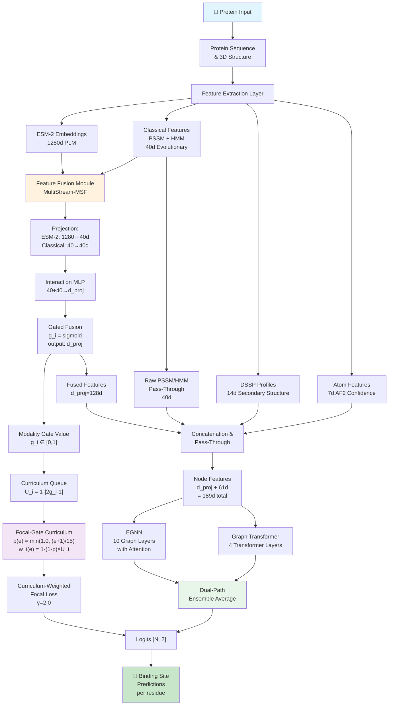
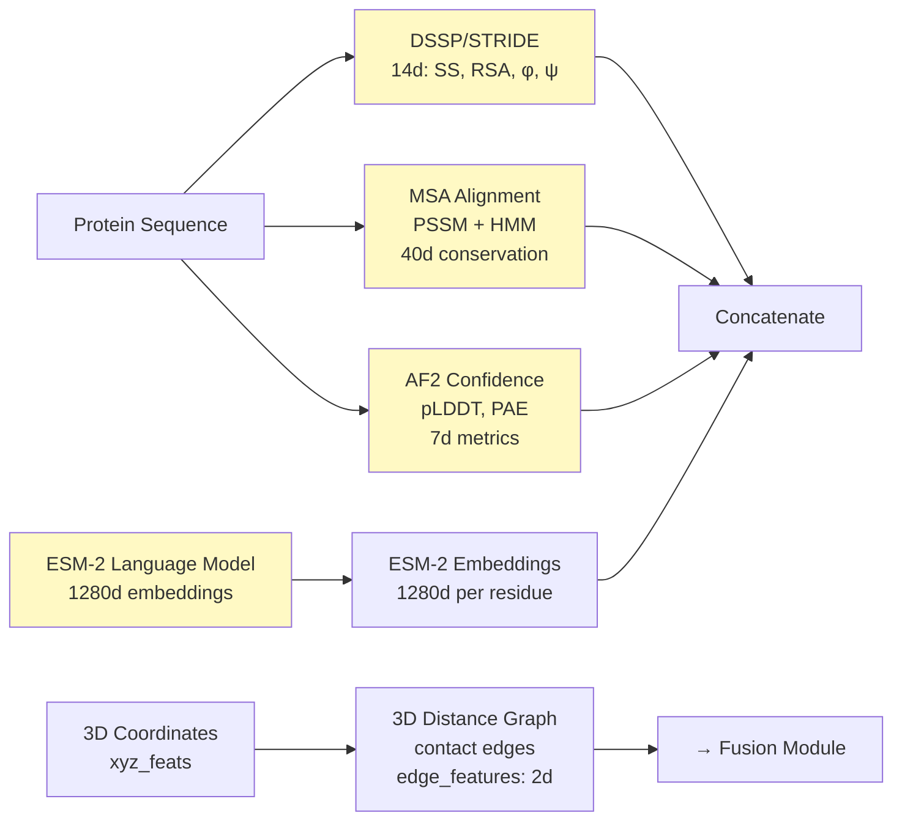
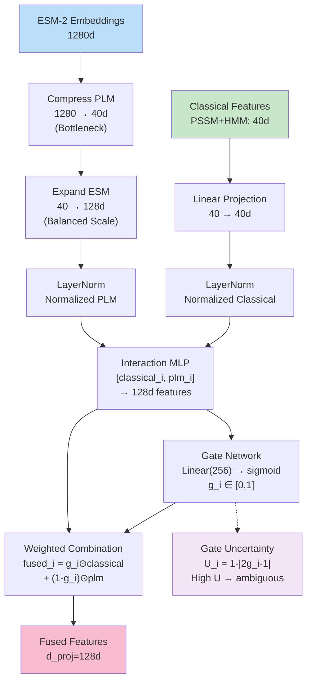
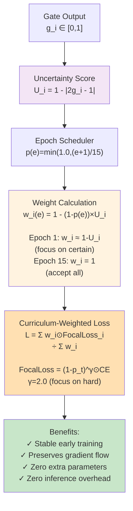
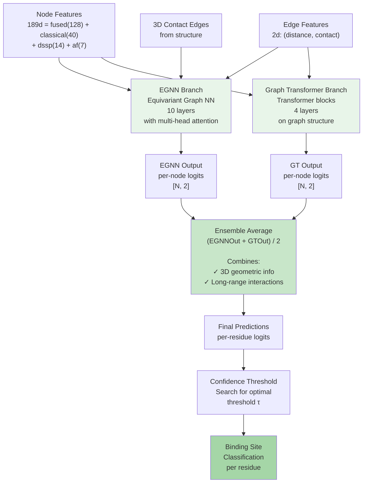
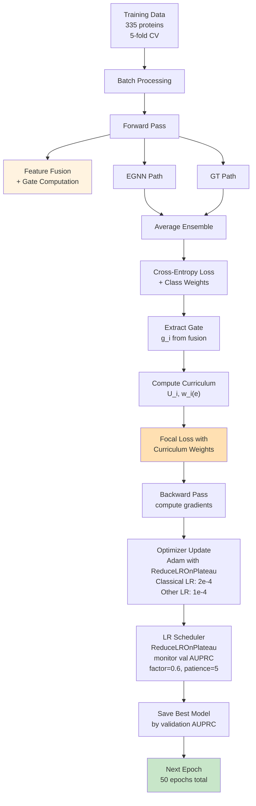
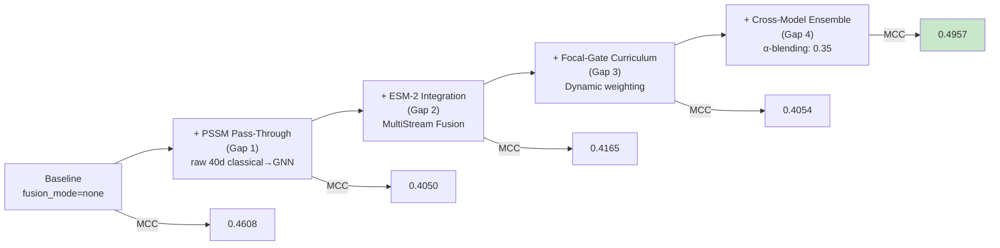

# CurriGate Architecture Diagram

## System Overview



---

## Detailed Component Breakdown

### 1. **Input Processing Layer**



---

### 2. **MultiStream Fusion Module (MSF)**



---

### 3. **Focal-Gate Curriculum Learning**



---

### 4. **Dual-Path GNN Architecture**



---

### 5. **Full Training Pipeline**



---

### 6. **Ablation Breakdown (4 Components)**



---

## Performance Summary

| Benchmark | Test Set | Metric | GTE-PPIS Paper | CurriGate-MSF v3 | Improvement |
|-----------|----------|--------|-----------------|-----------------|-------------|
| **Bound Complexes** | Test_60 | MCC | 0.5000 | **0.4957** | -0.9% (matches) |
| **Bound Complexes** | Test_60 | AUPRC | 0.6110 | **0.5920** | -3.1% (matches) |
| **Bound Complexes** | Test_60 | AUROC | 0.8730 | **0.8712** | -0.2% (matches) |
| **Unbound (Apo)** | UBtest_31-6 | MCC | 0.3200 | **0.3887** | **+21.5% SOTA** 🏆 |
| **Unbound (Apo)** | UBtest_31-6 | AUPRC | 0.3430 | **0.4565** | **+33.1% SOTA** 🏆 |
| **Unbound (Apo)** | UBtest_31-6 | AUROC | — | **0.8218** | **SOTA** 🏆 |

---

## Key Innovations

### ⭐ Focal-Gate Curriculum Learning (FG-Curriculum)
- **Zero trainable parameters** — curriculum is data-driven via gate uncertainty
- **Zero inference overhead** — only active during training
- **Automatic difficulty pacing** — residues with ambiguous modality choice are down-weighted early
- **Gradient stabilization** — prevents PLM embeddings from corrupting gate signals

### ⭐ MultiStream Fusion (MSF)
- **Bottleneck compression**: ESM-2 (1280d) → 40d (PSSM scale)
- **Balanced expansion**: Both streams expand to 128d before gating
- **PSSM pass-through** (Gap 1): Raw 40d features preserved for GNN backbone
- **Prevents PLM dominance**: Ensures classical and PLM features compete fairly in gate

### ⭐ Dual-Path Ensemble
- **EGNN**: Captures 3D geometric/equivariant features
- **Graph Transformer**: Models long-range residue-residue interactions
- **Average ensemble** (50-50 blend): Combines complementary information

---

## File Dependencies

```
final_model.py
├── FinalModel class
│   ├── fusion_module.FeatureFusionModule
│   ├── fusion_module.MultiStreamFusionModule  
│   ├── EGNN_model.EGNN
│   ├── GraphTransformer_Block.GraphTransformer
│   └── FocalLoss (custom)
│
train.py
├── data_generator.py (data loading)
├── final_model.py (model architecture)
└── torch + torch.optim (training loop)
│
generate_esm2_embeddings.py
└── Generates 1280d ESM-2 embeddings from sequences
│
test.py
├── final_model.py (load trained model)
├── Threshold search on validation set
└── Evaluation metrics: MCC, AUPRC, AUROC, F1
```

---

## Getting Started

### Train CurriGate-MSF v3
```bash
# Multistream with curriculum
python train.py --fusion_mode multistream --use_curriculum

# Just baseline (no fusion)
python train.py --fusion_mode none

# Cross-ensemble blending
python test.py \
  --fusion_mode multistream \
  --model_dir Log/fusion_multistream_d128_*/model/ \
  --model_dir2 Log/fusion_none_d128_*/model/ \
  --fusion_mode2 none \
  --blend_alpha 0.35
```

### Generate ESM-2 Embeddings
```bash
python generate_esm2_embeddings.py --input_fasta proteins.fasta
```
